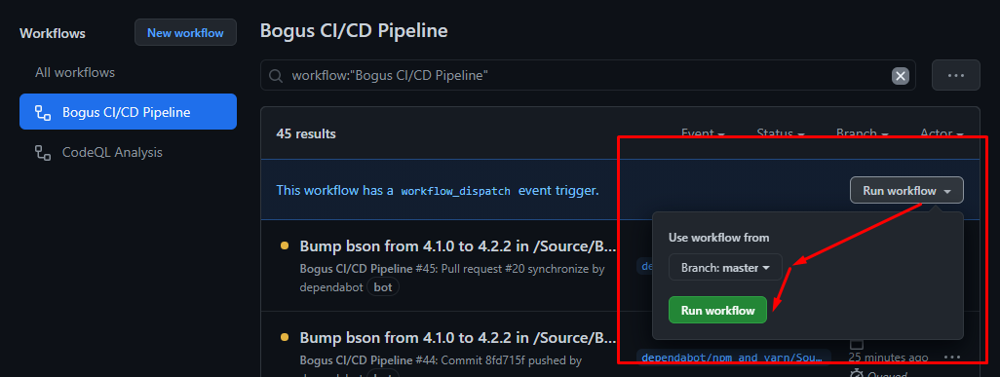

# MimeKit CI/CD documentation

* after merging the PR, the first run of the "MimeKit CI/CD Pipeline" workflow will not complete successfully, because it requires specific setup explained in this documentation.

## 1. Pipeline setup

1. Go to the project's GitHub repo

2. Go to the **Settings** tab -> **Secrets**

3. For Coveralls, add a new secret with the following:
	- Name - `COVERALLS_REPO_TOKEN`
	- Value - paste in the value of the token with the same name from the Appveyor pipeline

4. For MyGet, add a new secret with the following:
	- Name - `MYGET_API_KEY`
	- Value - paste in the value of the key from the Azure pipeline

If everything was set up correctly, a [manual execution](#3-run-workflow-manually) of the workflow should complete successfully with the build and test processes, and the publish of test results to Coveralls.

To execute a MyGet package publish, do a push commit to the default branch and to also execute a GitHub tag bump, the push commit should contain the `MimeKit.csproj` file with a bumped up version value of the `VersionPrefix` property.

 

## 2. Create "MimeKit CI/CD pipeline" status badge

- Go to the project's GitHub repo

- Click on the **Actions** tab

- On the left from the workflows list select "MimeKit CI/CD Pipeline"

- On the right click the **...** button and from the dropdown click on **Create status badge**

- From the "Branch" dropdown select "Default branch"

- From the "Event" dropdown select "push"

- Click on the **Copy status badge Markdown** button and paste it in the README.md file of the project

 

## 3. Run workflow manually

Once you've set up all the steps above correctly, you should be able to successfully complete a manual execution of the "MimeKit CI/CD Pipeline" workflow.

  1. Go to the project's GitHub repository and click on the **Actions** tab

  2. From the "Workflows" list on the left, click on "MimeKit CI/CD Pipeline"

  3. On the right, next to the "This workflow has a workflow_dispatch event trigger" label, click on the "Run workflow" dropdown, make sure the default branch is selected (if not manually changed, should be main or master) in the "Use workflow from" dropdown and click the "Run workflow" button

  4. Once the workflow run has completed successfully, move on to the next step of the documentation

NOTE: **screenshots are only exemplary**

#

Built with ❤ by [Pipeline Foundation](https://pipeline.foundation)